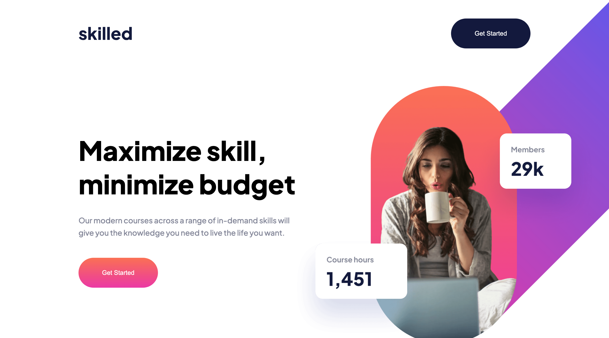

# Frontend Mentor - Skilled e-learning landing page

This is a solution to the [Skilled e-learning landing page challenge on Frontend Mentor](https://www.frontendmentor.io/challenges/skilled-elearning-landing-page-S1ObDrZ8q). Frontend Mentor challenges help you improve your coding skills by building realistic projects.

## Table of contents

- [Overview](#overview)
  - [The challenge](#the-challenge)
  - [Screenshot](#screenshot)
  - [Links](#links)
- [My process](#my-process)
  - [Built with](#built-with)
- [Author](#author)

## Overview

### The challenge

Users should be able to:

- View the optimal layout depending on their device's screen size
- See hover states for interactive elements

### Screenshot

### Links

- Solution URL: [Frontend Mentor Challenge Solution](https://www.frontendmentor.io/solutions/skilled-elearning-landing-page--APweIT3OE)
- Live Site URL: [Live Site](https://smallz97.github.io/skilled/)

## My process

### Built with

- Semantic HTML5 markup
- CSS Grid
- Mobile-first workflow

## Author

- Frontend Mentor - [@Smallz97](https://www.frontendmentor.io/profile/Smallz97)
